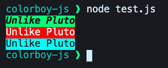

# colorboy
Easily add color to your `console.log`s in Node.js.

## Installation
```
npm install colorboy
```

## Usage
```js
require("colorboy").addDefaults();
console.log("Globgogabgalab".red);
console.log("Potato chips".cyan.underline.italic);
console.log("The Eden Project".color("#067CB6").bgColor([25, 25, 150]).bold);
```


### Colors
A color can be:
- A CSS keyword: `"red"`
- A hex code: `"#FF00FF"`
- An rgb code: `[255, 255, 255]`
- An rgb code: `[255, 255, 255, "rgb"]`
- An hsv code: `[32, 100, 50, "hsv"]`
- An hsl code: `[32, 100, 100, "hsl"]`
- An hwb code: `[32, 0, 50, "hwb"]`

### Styles
A style can be a string, or an array of strings. These are the possible strings:
- `"reset"`
- `"bold"`
- `"dim"`
- `"italic"`
- `"underline"`
- `"inverse"`
- `"hidden"`
- `"strikethrough"`
- `"visible"`

## Usage - Custom colors & styles
```js
let currentBgColor = 'red';

require('./index.js')
  .addDefaults()
  .addColor('greenish', {
    color: '#000000',
    bgColor: '#00FE7C',
    style: ['bold', 'italic'],
  })
  .addColorFunction('error', (color) => {
    return {
      color: color,
      bgColor: currentBgColor,
    }
  })
console.log('Custom:');
console.log('Unlike Pluto'.greenish);
console.log('Unlike Pluto'.error('white'));
currentBgColor = 'cyan'
console.log('Unlike Pluto'.error('black'));
```


### colorboy.addDefaults(functions, colors, styles)
Adds the default colorboy colors & styles. Takes three optional arguments, all true by default.
- `functions`: Set to false to not add any of the functions prototypes (`color`, `bgColor` and `style`)
- `colors`: Set to false to not add any of the colors prototypes (`red`, `green` etc)
- `styles`: Set to false to not add any of the styles prototypes (`bold`, `underline` etc)

### colorboy.addColor(name, options)
Adds a color prototype.
- The prototype name.
- A `colorboy options object` (see below).

### colorboy.addColorFunction(name, optionsCallback)
- The prototype name.
- A function that returns a `colorboy options object` (see below).

### colorboy options object
An object that defines colors and styles, in this format:
```
{
    color: COLOR,
    bgColor: COLOR,
    style: STYLE
}
```
